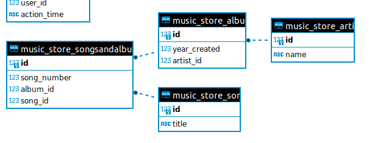
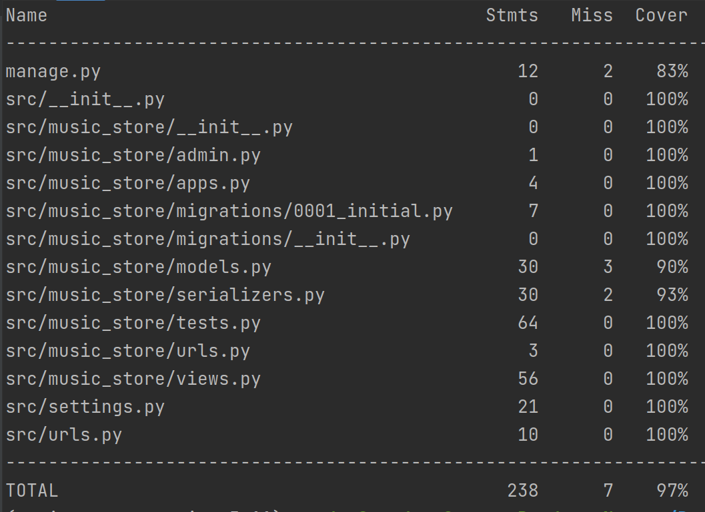

# Music_Storage_API

Music_Storage_API - backend-сервис на основе `Django REST Framework`, представляющий собой музыкальный каталог. В каталоге можно управлять музыкантами, их альбомами и песнями. 
База данных - `SQLite`. Зависимости - `Poetry`. Линтеры - `Black`, `Flake8`. Контейнеризация - `Docker`

## Описание схемы БД

База данных содержит 2 модели: `Artist`(Исполнитель), `Album`(Альбом) `Song`(Композиция). Ниже представлена графическая схема моделей и их взаимосвязей.



## Краткая документация API

Исчерпывающую информацию по работе API можно получить после запуска по адресу http://127.0.0.1:8000/
Документация на основе Swagger, в соответствии со стандартом OpenAPI.

## Тестирование

Код проекта был протестирован библиотекой PyTest. Покрытие кода тестами составило 93%



## Инструкция по установке

### 1. Подготовка проекта

1.1 Клонируете репозиторий
```sh
git clone https://github.com/XanderMoroz/music_storage_API.git
```
### 2.1 Запуск проекта без Doker

2.1.1 Устанавливаете зависимости проекта:
```sh
pip install -r requirements/dev.txt
```
2.1.2 Запускаете проект через терминал:
```sh
python manage.py runserver
```
2.2.2 Сервис доступен по адресу: http://127.0.0.1:8000/

### 2.2 Запуск проекта с Doker
2.2.1 Создаете и запускаете контейтер через терминал:
```sh
sudo docker-compose up
```
2.2.2 Сервис доступен по адресу: http://0.0.0.0:8000/
